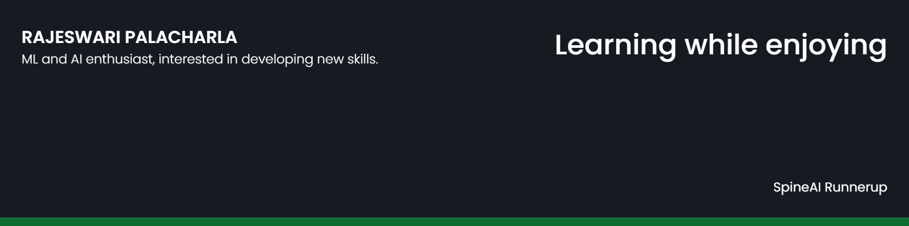

# Rajeswari0410

## 👩 About Me

- 🔭 I’m currently working on [LLMs and RAGs](https://github.com/Rajeswari0410/SentimentAnalysis)

- 🌱 I’m currently learning **Open-CV and developing Front-end skills**

## ✍ My Work

Here are some of my projects on Github that I am proud of:

Collaborated projects:

🚀 CinePrompt - Personalized Prompt based Recommendation

🚀 Continuing Education Credits Tracker

🚀 VitaFin - Personal Health and Budget Tracker

## 📚 My Skills

## 🤝 Connect

